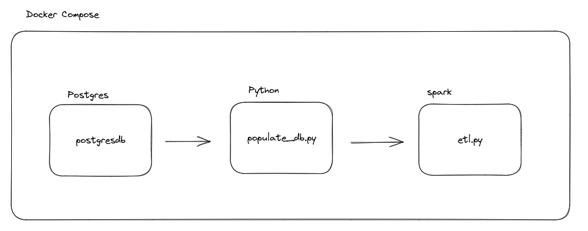

# Architecture



# Requirements
Docker

Docker-compose

Python >=3.10

# How to use


## Project

Make sure you are at the root of the project. The process can take 5 minutes to build and run.


```
docker-compose up
```

This command will instantiate three services:
- **postgresdb**: database that will contain the dummy data.
- **python**: Process that loads fake data into the database
- **spark**: Process that does the ETL of the data.

The end of the process will generate the data in the **data** folder with csv format, which is in the path: **services/process/data/** partitioned by the customer's name.


## Tests

Make sure you are at the root of the project.

```
python tests/test_core.py
```

# Improvements

## Fake Data
I decided to simplify the creation of data, that is, each customer has only one account and one associated card. And their IDs were constructed sequentially so that no mismatch occurred. With more time I would create other methods to create N X N relationships.

## CI/CD
Using github actions, we could put an action for every time it occurs - if a push in the main, we would have an image build for later deployment.

## Smaller image
I would try to use some smaller image for the base that I used in spark and python processes.


